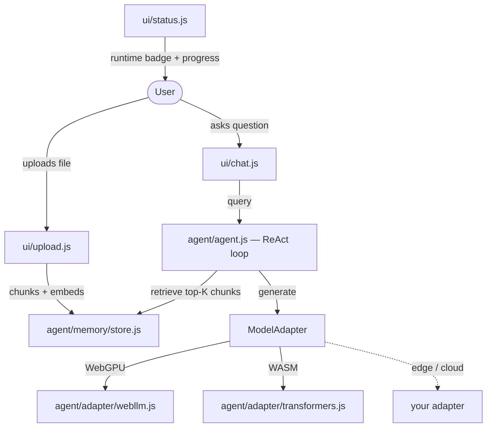
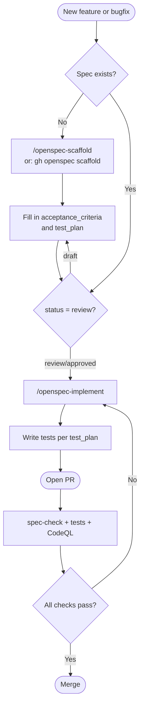

# Agent Capsule

  

**Agent Capsule** separates agent reasoning from model execution. The agent talks to a `ModelAdapter`; adapters decide whether inference happens in WebGPU, WASM, edge, or cloud. Swap the runtime — nothing else changes.

The built-in use case is **private document Q&A**: upload a PDF or text file, ask questions, get answers — entirely in the browser. No data leaves the client, no server required.

## Screenshot


*Uploading a CV and querying work experience entirely in-browser — no data leaves the client.*

## Limitations

Read this before filing a bug.

| Limitation | Detail |
|---|---|
| **First-load size** | ~2 GB download for the WebGPU model (Llama-3.2-3B). Cached after first use. WASM model is ~300 MB but slower. |
| **Browser support** | WebGPU requires Chrome 113+ or Edge 113+. Firefox and Safari fall back to WASM automatically. |
| **PDF extraction** | Text-based PDFs only. Scanned / image-only PDFs return empty text (no OCR). |
| **Vector store** | In-memory only. Vectors are lost on page refresh. Chunk metadata is cached in `localStorage` but re-embedding is required on next upload. |
| **Storage quota** | `localStorage` holds ~5 MB per origin. Large documents with many chunks may hit this limit. |
| **Headless model quality** | Headless Chromium cannot use WebGPU (SwiftShader lacks `shader-f16`). The WASM fallback uses `distilgpt2` by default — fast but weak at Q&A. Use the full browser UI for quality. |
| **Answer quality** | Answers are grounded only in retrieved chunks. If the relevant passage isn't in the top-5 results, the model will say it doesn't know. |

## Install and run

**Local**

```bash
npm install   # installs `serve`
npm run dev   # http://localhost:3000
```

Or without installing anything:

```bash
npx serve .
```

**Deploy to Railway**

[](https://railway.com/new)

1. Push this repo to GitHub.
2. In Railway: **New Project → Deploy from GitHub repo** → pick your fork.
3. Railway detects Node.js via `package.json`, runs `npm install`, and starts `npm start`.
4. Railway injects `PORT` automatically — no config needed.

The app serves the static files. Model weights are fetched from CDN by the visitor's browser on first use — the Railway instance itself is stateless and tiny (serves ~30 KB of HTML/JS/CSS).

> **Note:** Railway's hosted environment cannot run the headless A2A runner (`runner/`) — that requires a Chromium install. The static UI works fine from any static host.

| Browser | Runtime | Notes |
|---|---|---|
| Chrome 113+ / Edge 113+ | WebGPU | Recommended — hardware-accelerated |
| Firefox / Safari | WASM | Same API, slower first load |

## Architecture



The agent loop is a simple ReAct cycle (Reason → Act → Observe) with a max of 4 iterations. On each turn it retrieves the top-5 chunks by cosine similarity, builds a grounded system prompt, and calls the adapter. If the model requests a tool call (retrieve or summarize), the loop executes it and continues; otherwise it returns the final answer.

## The ModelAdapter interface

`ModelAdapter` (`agent/adapter/base.js`) is the only boundary between agent logic and model execution. Agent code, tools, and memory never import WebLLM or Transformers.js directly.

```js
adapter.generate(messages, options)   // → string
adapter.embed(text)                   // → Float32Array
adapter.toolCall(messages, tools)     // → { content, tool_calls? }
adapter.runtimeName()                 // → 'WebGPU' | 'WASM' | ...
adapter.isReady()                     // → boolean
```

To add a new runtime — Ollama, a cloud API, an edge worker — extend `ModelAdapter` and update the factory in `agent/adapter/index.js`. `agent.js`, all tools, and all UI files require zero changes.

```js
import { ModelAdapter } from './agent/adapter/base.js'

export class MyCloudAdapter extends ModelAdapter {
  async generate(messages, options = {}) { /* call your API */ }
  async embed(text)                      { /* call your embedding API */ }
  async toolCall(messages, tools)        { /* ... */ }
  runtimeName() { return 'MyCloud' }
  modelName()   { return 'my-model-v1' }
  isReady()     { return this._ready }
}
```

## Headless / A2A mode

Agent Capsule runs in a real Chromium process with no visible UI and exposes an [A2A](https://google.github.io/A2A/) JSON-RPC 2.0 HTTP endpoint that other agents or automation pipelines can call.

```bash
cd runner
npm install
npx playwright install chromium
node start.js
# A2A endpoint: http://localhost:8080
```

Send a task:

```bash
curl -X POST http://localhost:8080 \
  -H 'Content-Type: application/json' \
  -d '{
    "jsonrpc": "2.0",
    "method": "tasks/send",
    "id": "1",
    "params": {
      "id": "task-001",
      "message": {
        "role": "user",
        "parts": [{ "kind": "text", "text": "Summarise this document." }]
      }
    }
  }'
```

Retrieve a completed task:

```bash
curl -X POST http://localhost:8080 \
  -H 'Content-Type: application/json' \
  -d '{"jsonrpc":"2.0","method":"tasks/get","id":"2","params":{"id":"task-001"}}'
```

### Headless model override

Headless Chromium uses SwiftShader which does not support the `shader-f16` WGSL extension required by the default WebGPU model. The runner masks `navigator.gpu` so the adapter auto-selects WASM. Override the generation model for headless use:

```bash
# distilgpt2: 82 MB, fast, weak Q&A — suitable for integration tests
MODEL_REGISTRY_GEN_MODEL=Xenova/distilgpt2 node runner/start.js
```

### Air-gap / offline deployment

All CDN URLs and model IDs live in `agent/adapter/registry.js`. The runner injects overrides via `window.__MODEL_REGISTRY__` before any module loads:

```bash
MODEL_REGISTRY_WEBLLM_CDN=http://registry.internal/web-llm/esm \
MODEL_REGISTRY_TRANSFORMERS_CDN=http://registry.internal/transformers \
MODEL_REGISTRY_WEBLLM_MODEL=Llama-3.2-3B-Instruct-q4f16_1-MLC \
MODEL_REGISTRY_GEN_MODEL=Xenova/distilgpt2 \
node runner/start.js
```

### Environment variables

| Variable | Default | Description |
|---|---|---|
| `APP_PORT` | `3000` | Port for the static app server |
| `A2A_PORT` | `8080` | Port for the A2A JSON-RPC endpoint |
| `MODEL_TIMEOUT_MS` | `300000` | Max ms to wait for the model to load |
| `MODEL_REGISTRY_GEN_MODEL` | `Xenova/TinyLlama-1.1B-Chat-v1.0` | Generation model (WASM) |
| `MODEL_REGISTRY_EMBED_MODEL` | `Xenova/all-MiniLM-L6-v2` | Embedding model |
| `MODEL_REGISTRY_WEBLLM_CDN` | jsDelivr | CDN base URL for WebLLM |
| `MODEL_REGISTRY_TRANSFORMERS_CDN` | jsDelivr | CDN base URL for Transformers.js |
| `MODEL_REGISTRY_WEBLLM_MODEL` | `Llama-3.2-3B-Instruct-q4f16_1-MLC` | WebGPU model ID |

The model cache persists across restarts in `~/.agent_capsule_browser` (Chromium user-data dir).

## Project structure

```
agent_capsule/
├── index.html              # entry point — no build step
├── style.css               # flat, minimal UI (light/dark)
├── agent/
│   ├── agent.js            # ReAct loop
│   ├── adapter/
│   │   ├── base.js         # ModelAdapter interface
│   │   ├── registry.js     # CDN / model-ID config (air-gap hook)
│   │   ├── webllm.js       # WebGPU implementation
│   │   ├── transformers.js # WASM fallback
│   │   └── index.js        # runtime auto-detection
│   ├── tools/
│   │   ├── registry.js     # ToolRegistry
│   │   ├── retriever.js    # vector retrieval tool
│   │   └── summarizer.js   # summarization tool
│   └── memory/
│       ├── store.js        # in-memory vector store + localStorage metadata cache
│       └── embedder.js     # chunk embedder
├── ui/
│   ├── upload.js           # drag-and-drop ingestion + PDF parsing
│   ├── chat.js             # chat panel
│   └── status.js           # progress bar + runtime badge
└── runner/
    ├── chromium.js         # Playwright Chromium controller
    ├── a2a.js              # A2A JSON-RPC 2.0 server
    └── start.js            # headless entry point
```

---

## Development workflow (OpenSpec)

Every change to Agent Capsule starts with a spec file — no spec, no code. Specs live in `.openspec/specs/` and define acceptance criteria, test plans, and the implementation skill to use.

```bash
bash setup.sh   # install git hooks
```

### CI enforcement layers

| Layer | When | What |
|---|---|---|
| Git hook | `git commit` | Blocks commits with source changes but no spec |
| CI — deterministic | Every PR | Validates spec fields, status, test plan; runs tests |
| CI — agentic | Every PR | AI checks if the implementation satisfies the spec |
| CI — security | Every PR | CodeQL, gitleaks, dependency review |
| CI — supply chain | Every release | CycloneDX SBOM |

### Workflow



### Claude Code skills

| Skill | What it does |
|---|---|
| `/openspec-scaffold [feature]` | Scaffold a new spec file |
| `/openspec-implement [slug]` | Read spec, invoke domain skill, implement + write tests |
| `/openspec-check` | Validate spec coverage for current staged changes |

### Spec file format

Required fields: `title`, `description`, `acceptance_criteria`, `test_plan`, `status`

Status lifecycle: `draft` → `review` → `approved`

See `.openspec/specs/example-feature.spec.yaml` for a reference.

---

## Governance

| File | Purpose |
|---|---|
| [SECURITY.md](SECURITY.md) | Report a vulnerability privately |
| [CONTRIBUTING.md](CONTRIBUTING.md) | Contribution guide — spec-first |
| [CODE_OF_CONDUCT.md](CODE_OF_CONDUCT.md) | Contributor Covenant v2.1 |
| [SUPPORT.md](SUPPORT.md) | Where to get help |
| [CHANGELOG.md](CHANGELOG.md) | Release history |
| [docs/BRANCH_PROTECTION.md](docs/BRANCH_PROTECTION.md) | Recommended branch ruleset config |

---

**Developer:** Eduardo Arana

**License:** [MIT](LICENSE)

---

[](https://ko-fi.com/H2H51MPWG)
