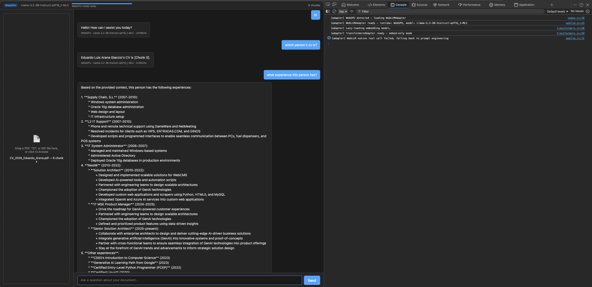
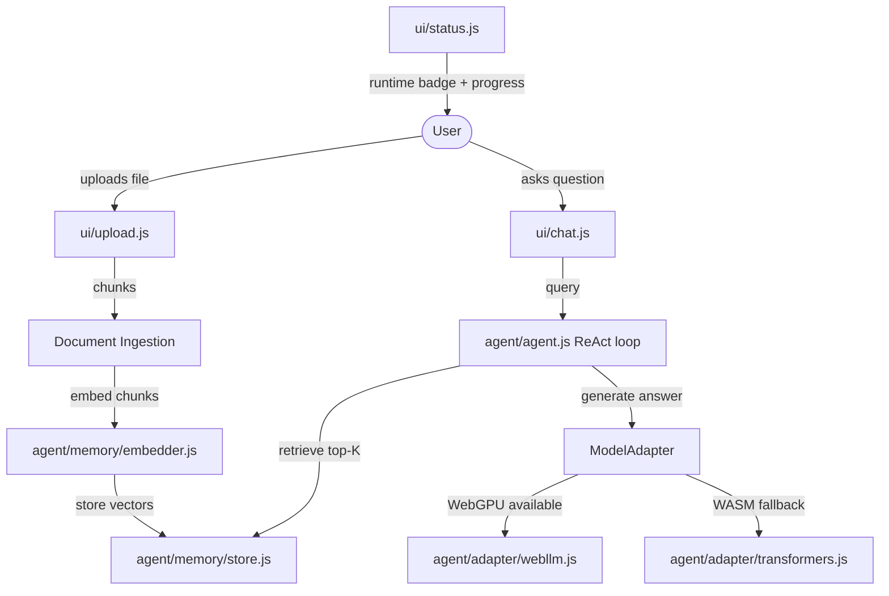
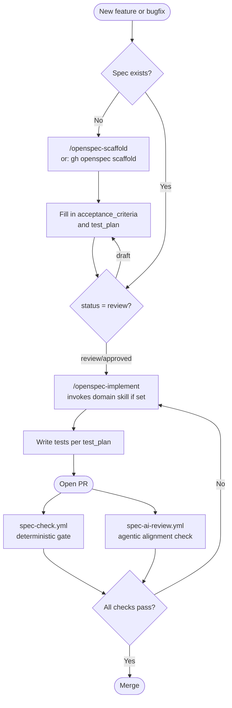

# browser-agent-poc

  

A browser-native AI agent for private document Q&A running entirely client-side using WebGPU/WASM with a portable model adapter interface.

## Screenshot



*Uploading a CV and querying work experience entirely in-browser, no data leaves the client.*

## Running the agent

```bash
npx serve .
# open http://localhost:3000
```

No build step. No bundler. No install. Upload a PDF or text file and ask questions — nothing leaves your browser.

## Browser requirements

| Browser | Runtime | Notes |
|---|---|---|
| Chrome 113+ / Edge 113+ | WebGPU | Recommended — hardware-accelerated |
| Firefox / Safari | WASM | Slower first load, same API |

## First load

Model weights download on first use (~2 GB for Llama-3.2-3B via WebGPU). Cached in the browser cache after the first download.

## Architecture



## Model Adapter

The `ModelAdapter` interface (`agent/adapter/base.js`) is the only abstraction between agent logic and the model runtime. Agent and tool code calls only:

- `adapter.generate(messages, options)` — text generation
- `adapter.embed(text)` — returns `Float32Array`
- `adapter.toolCall(messages, tools)` — structured tool call

To add a new runtime, extend `ModelAdapter` and update `agent/adapter/index.js`. No other files change.

## Extending to edge / cloud

```js
import { ModelAdapter } from './agent/adapter/base.js'

export class MyCloudAdapter extends ModelAdapter {
  async generate(messages, options = {}) { /* call your API */ }
  async embed(text) { /* call your embedding API */ }
  async toolCall(messages, tools) { /* ... */ }
  runtimeName() { return 'MyCloud' }
  modelName()   { return 'my-model-v1' }
  isReady()     { return this._ready }
}
```

## Headless / A2A mode

The agent runs in a real Chromium process with no visible UI and exposes an A2A JSON-RPC 2.0 HTTP endpoint that other agents or automation pipelines can call.

```bash
cd runner
npm install
npx playwright install chromium
node start.js
# A2A endpoint: http://localhost:8080
```

Send a task:

```bash
curl -X POST http://localhost:8080 \
  -H 'Content-Type: application/json' \
  -d '{
    "jsonrpc": "2.0",
    "method": "tasks/send",
    "id": "1",
    "params": {
      "id": "task-001",
      "message": {
        "role": "user",
        "parts": [{ "kind": "text", "text": "Summarise this document." }]
      }
    }
  }'
```

Retrieve a completed task by ID:

```bash
curl -X POST http://localhost:8080 \
  -H 'Content-Type: application/json' \
  -d '{"jsonrpc":"2.0","method":"tasks/get","id":"2","params":{"id":"task-001"}}'
```

### Runtime selection in headless mode

Headless Chromium uses SwiftShader as its GPU backend, which does **not** support the `shader-f16` WGSL extension required by the default WebGPU model. The runner therefore masks `navigator.gpu` on startup so the adapter auto-selects the WASM/Transformers.js path — the same fallback that runs in Firefox or Safari.

Additionally, TinyLlama's KV-cache tensors exceed the ONNX Runtime WebAssembly buffer limits inside Playwright's sandboxed renderer. For headless use, override the generation model to a smaller one via the `MODEL_REGISTRY_GEN_MODEL` env var:

```bash
# Recommended for headless: distilgpt2 (82 MB, 6 transformer layers)
MODEL_REGISTRY_GEN_MODEL=Xenova/distilgpt2 node runner/start.js
```

For full Q&A quality with an uploaded document, run the interactive browser UI instead (Chrome 113+ with WebGPU), or provide a self-hosted model server via the registry env vars below.

### Air-gap / offline deployment

All model CDN URLs and model IDs live in `agent/adapter/registry.js` which checks `window.__MODEL_REGISTRY__` at startup. The runner injects this object before any module loads:

```bash
MODEL_REGISTRY_WEBLLM_CDN=http://registry.internal/web-llm/esm \
MODEL_REGISTRY_TRANSFORMERS_CDN=http://registry.internal/transformers \
MODEL_REGISTRY_WEBLLM_MODEL=Llama-3.2-3B-Instruct-q4f16_1-MLC \
MODEL_REGISTRY_GEN_MODEL=Xenova/distilgpt2 \
node runner/start.js
```

Nothing changes in the agent or adapter code — only the URLs the models are fetched from.

### Environment variables

| Variable | Default | Description |
|---|---|---|
| `APP_PORT` | `3000` | Port for the static app server |
| `A2A_PORT` | `8080` | Port for the A2A JSON-RPC endpoint |
| `MODEL_TIMEOUT_MS` | `300000` | Max ms to wait for the model to load |
| `MODEL_REGISTRY_GEN_MODEL` | `Xenova/TinyLlama-1.1B-Chat-v1.0` | Generation model (override for headless) |
| `MODEL_REGISTRY_EMBED_MODEL` | `Xenova/all-MiniLM-L6-v2` | Embedding model |
| `MODEL_REGISTRY_WEBLLM_CDN` | jsDelivr | CDN base URL for WebLLM (air-gap) |
| `MODEL_REGISTRY_TRANSFORMERS_CDN` | jsDelivr | CDN base URL for Transformers.js (air-gap) |
| `MODEL_REGISTRY_WEBLLM_MODEL` | `Llama-3.2-3B-Instruct-q4f16_1-MLC` | WebGPU model ID |

The model cache persists across restarts in `~/.agent_capsule_browser` (Chromium user-data dir), so subsequent starts load from disk in seconds.

## Project structure

```
browser-agent-poc/
├── index.html              # entry point
├── style.css               # flat, minimal UI
├── agent/
│   ├── agent.js            # ReAct loop
│   ├── adapter/
│   │   ├── base.js         # ModelAdapter interface
│   │   ├── registry.js     # CDN / model-ID config (air-gap hook)
│   │   ├── webllm.js       # WebGPU implementation
│   │   ├── transformers.js # WASM fallback
│   │   └── index.js        # runtime auto-detection
│   ├── tools/
│   │   ├── registry.js     # ToolRegistry
│   │   ├── retriever.js    # vector retrieval tool
│   │   └── summarizer.js   # summarization tool
│   └── memory/
│       ├── store.js        # in-memory + localStorage
│       └── embedder.js     # chunk embedder
├── ui/
│   ├── upload.js           # drag-and-drop ingestion
│   ├── chat.js             # chat panel
│   └── status.js           # progress bar + runtime badge
└── runner/
    ├── chromium.js         # Playwright Chromium controller
    ├── a2a.js              # A2A JSON-RPC 2.0 server
    └── start.js            # entry point
```

---

## What is OpenSpec?

OpenSpec is a spec-driven development framework built into this repo. Every feature or bugfix starts with a spec file — no spec, no code. Specs define acceptance criteria, test plans, and the domain skill to use during implementation.

**Layers of enforcement:**

| Layer | When | What |
|---|---|---|
| Git hook (local) | `git commit` | Blocks commits with source changes but no spec |
| Pre-commit framework (optional) | `git commit` | Runs gitleaks, yamllint, markdownlint, shellcheck |
| CI — deterministic | Every PR | Validates spec fields, status, test_plan, and runs the test suite |
| CI — agentic | Every PR | AI checks if the implementation actually satisfies the spec |
| CI — security | Every PR | CodeQL SAST, gitleaks secret scan, dependency review |
| CI — supply chain | Every release | CycloneDX SBOM generation |

---

## How it works



---

## Quick start

### 1. Configure this repo

Open it in [Claude Code](https://claude.ai/code) — it detects the unconfigured state and interviews you automatically.

Or configure manually:

```bash
# Edit the five required fields
vi .openspec/config.yaml

# Install git hooks
bash setup.sh
```

### 2. Set your personal defaults (optional)

Fill in `.openspec/defaults.yaml` once — onboarding will skip questions you've already answered:

```yaml
owner: "your-github-org"
team: "your-team"
test_command: "npm test"
default_implementation_skill: "frontend-pro"  # or backend-pro, devops-pro, etc.
```

### 3. Create your first spec

```bash
gh openspec scaffold "my first feature"
# or in Claude Code:
/openspec-scaffold my first feature
```

### 4. Implement with the right domain skill

```bash
# In Claude Code — reads the spec, invokes implementation_skill if set
/openspec-implement my-first-feature
```

### 5. Validate before pushing

```bash
gh openspec check           # validate all specs
gh openspec check --strict  # treat warnings as errors
gh openspec check --pr 42   # check a specific PR
```

---

## Claude Code skills

Three project skills are available in any Claude Code session:

| Skill | What it does |
|---|---|
| `/openspec-scaffold [feature]` | Guided spec creation — reads defaults, scaffolds file, validates required fields |
| `/openspec-implement [slug]` | Reads spec, checks status, invokes domain skill, implements + writes tests |
| `/openspec-check` | Validates spec coverage for current staged changes |

---

## Project structure

```
.openspec/
├── config.yaml              # Project configuration and enforcement settings
├── defaults.yaml            # Personal/team defaults (fill in once)
├── onboarding.yaml          # Questions Claude Code asks during first-time setup
├── specs/                   # Active spec files (one per feature/bugfix)
│   └── example-feature.spec.yaml
└── templates/
    ├── feature.spec.yaml
    └── bugfix.spec.yaml

.github/
├── workflows/
│   ├── spec-check.yml           # Deterministic CI gate + test runner
│   ├── spec-ai-review.yml       # Agentic semantic review
│   ├── spec-bootstrap.yml       # First-push setup reminder
│   ├── repo-init.yml            # Creates `main` branch on new repos from template
│   ├── codeql.yml               # Static analysis (SAST)
│   ├── secret-scan.yml          # Gitleaks secret scanning
│   ├── dependency-review.yml    # Vulnerable / disallowed-license deps
│   ├── sbom.yml                 # CycloneDX SBOM on release
│   ├── labeler.yml              # Path-based PR labels
│   ├── release-drafter.yml      # Auto-drafted release notes
│   └── stale.yml                # Stale issue/PR bot
├── ISSUE_TEMPLATE/
│   ├── bug_report.yml
│   ├── feature_request.yml
│   ├── spec_question.yml
│   └── config.yml
├── agents/
│   └── spec-review.md           # AI agent goal file
├── CODEOWNERS                   # Ownership matrix
├── FUNDING.yml                  # Sponsor links
├── AGENTS.md                    # Instructions for AI agents
├── copilot-instructions.md      # GitHub Copilot instructions
├── dependabot.yml               # Weekly dependency updates
├── labeler.yml                  # Rules for path-based labelling
├── pull_request_template.md     # Structured PR template
└── release-drafter.yml          # Release-notes grouping config

.claude/
├── commands/
│   ├── openspec-scaffold.md
│   ├── openspec-implement.md
│   └── openspec-check.md
├── hooks/
│   └── require-spec-on-commit.sh
└── settings.json

docs/
└── BRANCH_PROTECTION.md         # Recommended ruleset configuration

Governance (repo root):
├── SECURITY.md                  # Vulnerability disclosure policy
├── CONTRIBUTING.md              # Contribution guide (spec-first)
├── CODE_OF_CONDUCT.md           # Contributor Covenant v2.1
├── SUPPORT.md                   # Support channels
├── CHANGELOG.md                 # Keep-a-Changelog
├── .gitignore                   # Multi-language defaults
├── .gitattributes               # Line endings + linguist hints
├── .editorconfig                # Editor formatting rules
├── .pre-commit-config.yaml      # Optional pre-commit hooks
└── .yamllint                    # YAML lint rules
```

## Governance

| File | Purpose |
|---|---|
| [SECURITY.md](SECURITY.md) | Report a vulnerability privately |
| [CONTRIBUTING.md](CONTRIBUTING.md) | How to contribute — spec-first |
| [CODE_OF_CONDUCT.md](CODE_OF_CONDUCT.md) | Contributor Covenant v2.1 |
| [SUPPORT.md](SUPPORT.md) | Where to get help |
| [CHANGELOG.md](CHANGELOG.md) | Release history |
| [.github/CODEOWNERS](.github/CODEOWNERS) | Ownership matrix |
| [docs/BRANCH_PROTECTION.md](docs/BRANCH_PROTECTION.md) | Recommended GitHub rulesets |

---

## Spec file format

See `.openspec/specs/example-feature.spec.yaml` for a fully filled-in reference.

Required fields: `title`, `description`, `acceptance_criteria`, `test_plan`, `status`

Status lifecycle: `draft` → `review` → `approved`

> Code can only be written when status is `review` or `approved`.

---

## Coding Guidelines

This project follows the [Karpathy-Inspired Coding Guidelines](https://github.com/forrestchang/andrej-karpathy-skills) — four principles derived from [Andrej Karpathy's observations](https://x.com/karpathy/status/2015883857489522876) on common LLM coding pitfalls:

| Principle | What it addresses |
|---|---|
| **Think Before Coding** | Wrong assumptions, hidden confusion, missing tradeoffs |
| **Simplicity First** | Overcomplication, bloated abstractions |
| **Surgical Changes** | Orthogonal edits, touching code you shouldn't |
| **Goal-Driven Execution** | Leverage through tests-first, verifiable success criteria |

These guidelines are integrated into [`CLAUDE.md`](CLAUDE.md) and work alongside OpenSpec — Principle 4 (Goal-Driven Execution) is structurally enforced through spec `acceptance_criteria` and `test_plan` fields.

---

**Developer:** Eduardo Arana

**License:** [MIT](LICENSE)

---

[](https://ko-fi.com/H2H51MPWG)
